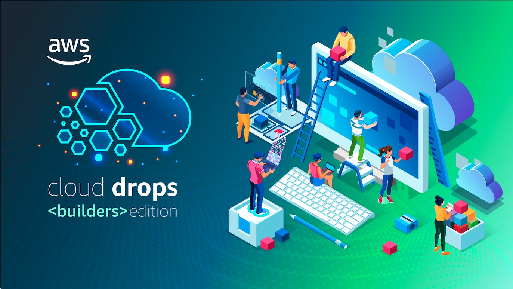

 

[🏠 Página principal](https://www.youtube.com/watch?v=Ng_8PlvzA3Y&list=PLQHh55hXC4yrlnKxKDsLPFl5O6sTfXWHu) | [▶️ YouTube](https://www.youtube.com/@AmazonWebServicesLatinAmerica) 

Esta é o repositório principal do *AWS Cloud Drops Builders Edition - Brasil*, um programa bisemanal, leve e descontraído para Builders que sujam as mãos utilizando AWS. O programa conta com a apresentação dos AWS Developers Advocates LATAM [Ana Cunha](https://www.linkedin.com/in/analuizacunha/) e [Marcelo Palladino](https://www.linkedin.com/in/mfpalladino/), além de contar com participações de especialistas da AWS e da comunidade AWS.

### 🎙️ Lista de episódios 

#### Primeira temporada - 2023-2024

* [#0: **Conheça os Large Language Models (LLMs) e o ciclo de vida de um projeto de IA generativa**](/episode/0) [[vídeo](https://youtu.be/DwTV5uNENqo?list=PLQHh55hXC4yrsSptdH0mh0QyHWiI4waUV&t=313)]
* [#1: **Como integrar modelos fundacionais ao seu código com Amazon Bedrock**](/episode/1) [[vídeo](https://youtu.be/Ng_8PlvzA3Y?list=PLQHh55hXC4yrsSptdH0mh0QyHWiI4waUV&t=340)]
* [#2: **Programação em par turbinada por IA: Crie uma aplicação com Amazon CodeWhisperer**](/episode/2) [[vídeo](https://www.youtube.com/watch?v=nMNPN0q8Sfo)]
* [#3: **Sumarizando textos com IA Generativa e Prompt Engineering**](/episode/3) [[vídeo](https://www.youtube.com/watch?v=QkkUcbtzoIg)]
* [#4: **Ajustando LLMs com instruction fine-tuning**](/episode/4) [[vídeo](https://www.youtube.com/watch?v=pD7ol5xDGm8)]
* [#5: **Ajustando LLMs com Parameter efficient fine-tunning (PEFT)**](/episode/5) [[vídeo](https://www.youtube.com/watch?v=18eWp6ceP4k)]
* [#6: **Usando RAG para melhorar respostas utilizando Knowledge Bases for Amazon Bedrock**](/episode/6) [[vídeo](https://www.youtube.com/watch?v=7lF8_9bG15Q)]
* [#7: **Knowledge Bases for Amazon Bedrock NA PRÁTICA**](/episode/7) [[vídeo](https://www.youtube.com/watch?v=tS8GfsnMSbI)]
* [#8: **Projetos de IA Generativa NA PRÁTICA**](/episode/8) [[vídeo](https://www.youtube.com/watch?v=6FC9iFdLoZQ)]

### ☕ Canecas utilizadas 

#### Primeira temporada - 2023-2024

* [#0: **Caneca de comemoração de 10 anos do JoinCommunity**](/mug/0/10%20anos%20JoinCommunity.jpeg)
* [#2: **Caneca do Serverless Days São Paulo 2023**](/mug/2/Serverless%20Days%20São%20Paulo%202023.jpeg)
* [#3: **Que a força esteja com você (sugestão da audiência)**](/mug/3/may%20the%20force%20be%20with%20you.jpg)
* [#4: **Copo do DevOps Days Belém 2023**](/mug/4/devops%20days%20belem%202023.jpg)
* [#5: **Smile**](/mug/5/smile.jpg)
* [#6: **Hamilton**](/mug/6/hamilton.jpg)
* [#7: **Hamilton (porque o Palla esqueceu de trazer o copo no último episódio 😂)**](/mug/6/hamilton.jpg)
* [#8: **Garrafa Work Hard, Have Fun, Make History**](/mug/8/work%20hard%20have%20fun%20make%20history.jpeg) | [**Caneca do Serverless Days São Paulo 2023**](/mug/2/Serverless%20Days%20São%20Paulo%202023.jpeg)
