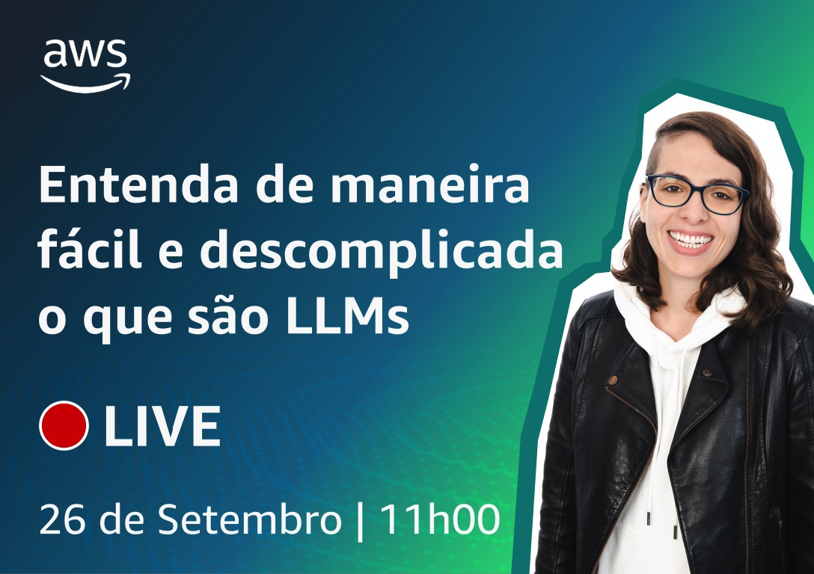

# Episódio 1 - Conheça os Large Language Models (LLMs) e o ciclo de vida de um projeto de IA generativa

**[&#x25b6; Assista agora no Youtube!](https://youtu.be/DwTV5uNENqo?list=PLQHh55hXC4yrsSptdH0mh0QyHWiI4waUV&t=313)**

Neste episódio você verá as definições de IA Generativa e LLM. Além disso, há exemplos de engenharia de prompt e utilização do Amazon SageMaker JumpStart e playgrounds de modelos generativos de texto. 

Se você gostou do conteúdo e que ser notificado sobre próximos episódios, [por favor, assine o canal](https://www.youtube.com/@AmazonWebServicesLatinAmerica).

Palavras-chave: IA Generativa, Engenharia de prompt 

## Especialistas convidados

* [Fabio Balancin](https://www.linkedin.com/in/fabiobalancin/)
* [Evandro Franco](https://www.linkedin.com/in/evandrogfranco/)

## O que mencionamos durante o episódio

* [O que é IA Generativa? - Português](https://www.youtube.com/watch?v=4tqGA3-JXUc)
* [Amazon SageMaker JumpStart](https://youtu.be/DwTV5uNENqo?t=2287)
* [Engenharia de prompt](https://youtu.be/DwTV5uNENqo?t=2460)
* [Mais engenharia de prompt, Zero-Shot, One-Shot, Few-Shot](https://youtu.be/DwTV5uNENqo?t=2908)

## 🐛 Bugs em produção

O primeiro minuto foi um tanto atabalhoado por conta do som. Quem viu ao vivo, viu. Quem não viu não vai ver mais, já que editamos o vídeo para remover esta parte. 🙂

## 🫰 Dívida técnica

Esquecemos de citar o ciclo de vida de um projeto com IA Generativa. Pagamos a dívida no segundo episódio e vamos voltar ao tema, já que quase todos os outros episódios irão flutuar em torno do mesmo ciclo.  

* [Ciclo de vida de uma aplicação com IA Generativa](https://youtu.be/Ng_8PlvzA3Y?t=2942)

## Onde aprender mais

**[DeepLearning.AI](https://www.deeplearning.ai/courses/generative-ai-with-llms/)**
