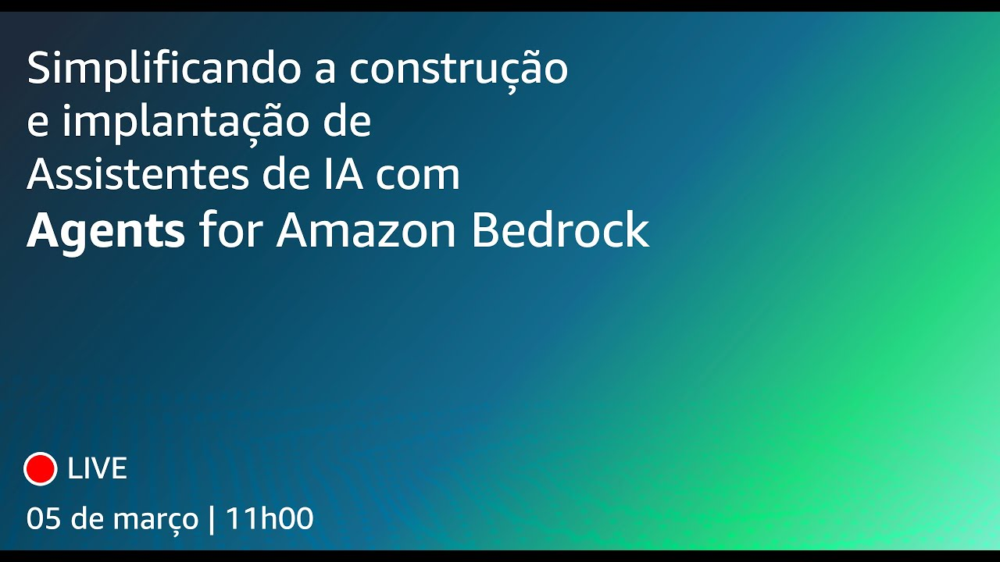

# Episódio 11 - Simplificando a construção e implantação de assistentes de IA com Agents for Amazon Bedrock

**[&#x25b6; Assista agora no Youtube!](https://youtube.com/live/abQmX-3vpSQ)**

Depois de ouvir os feedbacks de vocês, aqui estamos nós para um episódio EXTRA da primeira temporada do AWS Cloud Drops Builders Edition, para falarmos exclusivamente sobre Agents for Amazon Bedrock. 

Bóra Buildar!

## O que mencionamos durante o episódio

00:00:00 Introdução
00:04:27 Motivações para o episódio EXTRA
00:04:59 A Stack de IA Generativa da AWS
00:07:46 Por que customizar?
00:09:59 Customizar vs enriquecer o prompt (augment)
00:13:42 Desafios das automações de fluxo
00:15:22 Agents for Amazon Bedrock
00:17:15 Benefícios do Agents for Amazon Bedrock
00:19:02 Resolvendo tarefas com Agents for Amazon Bedrock
00:19:55 Noções básicas sobre agentes
00:30:25 Juntando tudo nas demos
00:01:36 Finalização

## 🐛 Bugs em produção

## 🫰 Dívida técnica

## Onde aprender mais

* [Código com o exemplo do assistente de reuniões (Github)](git@github.com:AWS-Cloud-Drops-Builders-Edition/s01e11.git)
* [Amazon Bedrock samples | Agents (Github)](https://github.com/aws-samples/amazon-bedrock-samples/tree/main/agents)
* [Amazon Bedrock Agents Demos (YouTube)](https://www.youtube.com/watch?v=JkDzZFTXeSw)

**[Bóra construir uma aplicação baseada em IA](https://partyrock.aws/)**

**[DeepLearning.AI](https://www.deeplearning.ai/courses/generative-ai-with-llms/)**
