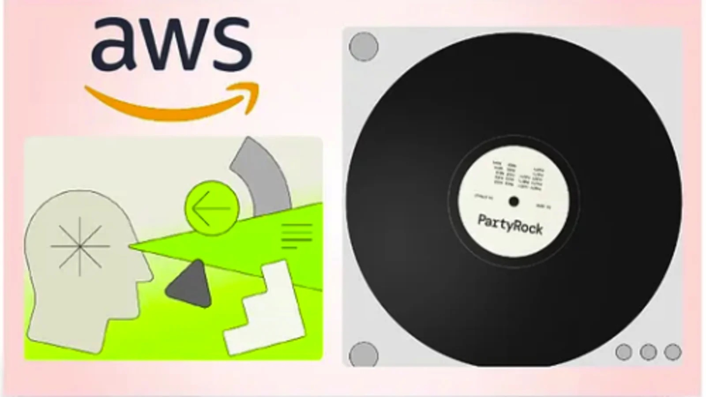

# Episódio 11 - Simplificando a construção e implantação de assistentes de IA com Agents for Amazon Bedrock

**[&#x25b6; Assista agora no Youtube!](https://youtube.com/live/abQmX-3vpSQ)**

Depois de ouvir os feedbacks de vocês, aqui estamos nós para um episódio EXTRA da primeira temporada do AWS Cloud Drops Builders Edition, para falarmos exclusivamente sobre Agents for Amazon Bedrock. 

Bóra Buildar!

## O que mencionamos durante o episódio

## 🐛 Bugs em produção

## 🫰 Dívida técnica

## Onde aprender mais

* [Código com o exemplo do assistente de reuniões (Github)](git@github.com:AWS-Cloud-Drops-Builders-Edition/s01e11.git)
* [Amazon Bedrock samples | Agents (Github)](https://github.com/aws-samples/amazon-bedrock-samples/tree/main/agents)
* [Amazon Bedrock Agents Demos (YouTube)](https://www.youtube.com/watch?v=JkDzZFTXeSw)

**[Bóra construir uma aplicação baseada em IA](https://partyrock.aws/)**

**[DeepLearning.AI](https://www.deeplearning.ai/courses/generative-ai-with-llms/)**
