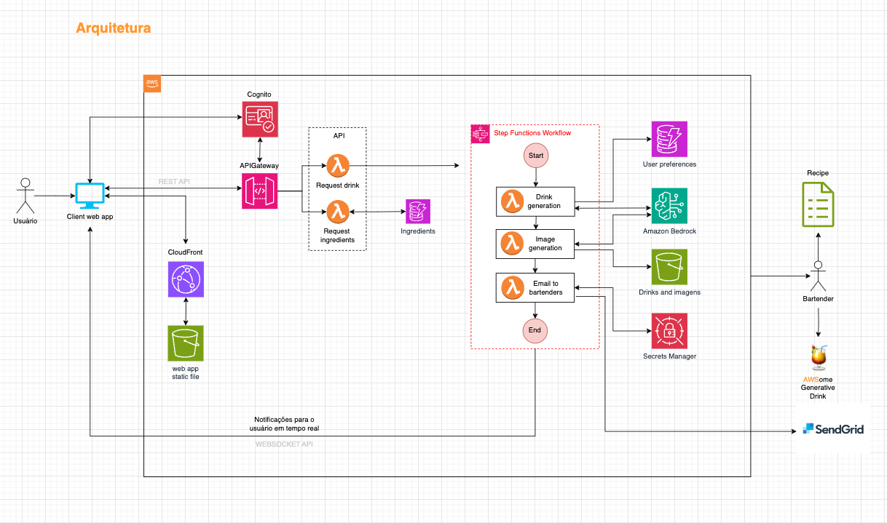

# Episódio 02, Temporada 02 - [NA PRÁTICA - Parte 2] Arquitetura do AWSome Generative Drink App

**[&#x25b6; Assista agora no Youtube!](https://bit.ly/cdbe-s02ep02)**

Nesta temporada nós vamos construir uma aplicação Serverless completa com IA generativa DO ZERO! 

Neste episódio, vamos continuar imediatamente de onde paramos no episódio anterior. Vamos definir a arquitetura da solução e utilizar o Amazon Q Developer para tirar dúvidas sobre as escolhas do desenho. 

Esta é a temporada perfeita para você que está começando com desenvolvimento de software na AWS e se interessa em IA generativa.

Bóra Buildar!

## O que mencionamos durante o episódio

[Orquestração x Coreografia](https://docs.aws.amazon.com/pt_br/prescriptive-guidance/latest/cloud-design-patterns/cloud-design-patterns.pdf)

## Onde aprender mais

- [AWSome Generative Drink App (Github)](https://bit.ly/awsome-generative-drink-app)
- [AWSome Generative Drink App (Quadro branco)](https://bit.ly/cdbe-s02-wb)