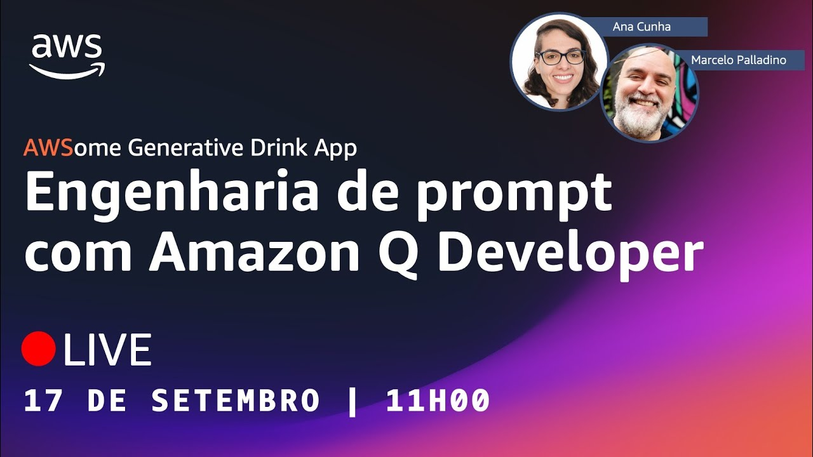
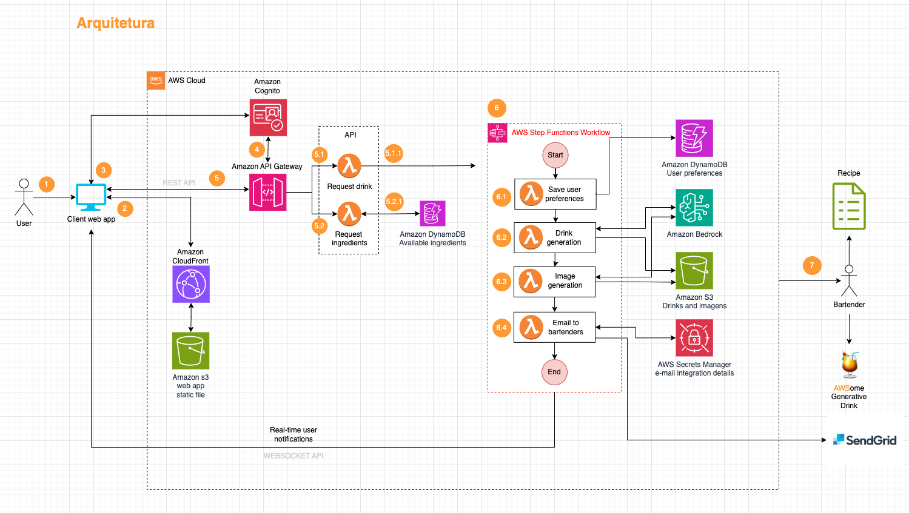

# Episódio 03, Temporada 02 - [NA PRÁTICA - Parte 3] Engenharia de prompt com Claude 3 e Amazon Q Developer

**[&#x25b6; Assista agora no Youtube!](https://bit.ly/cdbe-s02e03)**

Bem-vindo(a) a mais um episódio da segunda temporada do AWS Cloud Drops Builders Edition!

Nós estamos construindo uma aplicação Serverless com IA generativa DO ZERO! 

Neste episódio, vamos receber o Nelson Crepalde, Generative AI Strategist da AWS, para nos ajudar a definir os prompts das funcionalidades que utilizam IA generativa e falar sobre técnicas e boas práticas para construir bons prompts. 

Bóra Buildar!

## 🤖 Conversinha com o Amazon Q Developer

#### O que pedimos?

- I need to develop a GenAI assistant with Claude 3. Where do I start?
- I want to start developing a prompt for Claude 3. Can you point me to the best practices on building a good prompt for this LLM?
- Why is it good to use XML tags to build prompts for Claude 3?
- What is the difference between a System prompt and a Human prompt when working with Claude 3?

## Onde aprender mais

- [Notebook com o código do episódio (Github)](./main.ipynb)
- [AWSome Generative Drink App (Github)](https://bit.ly/awsome-generative-drink-app)
- [AWSome Generative Drink App (Quadro branco)](https://bit.ly/cdbe-s02-wb)
- [O que é engenharia de prompt](https://aws.amazon.com/pt/what-is/prompt-engineering/)