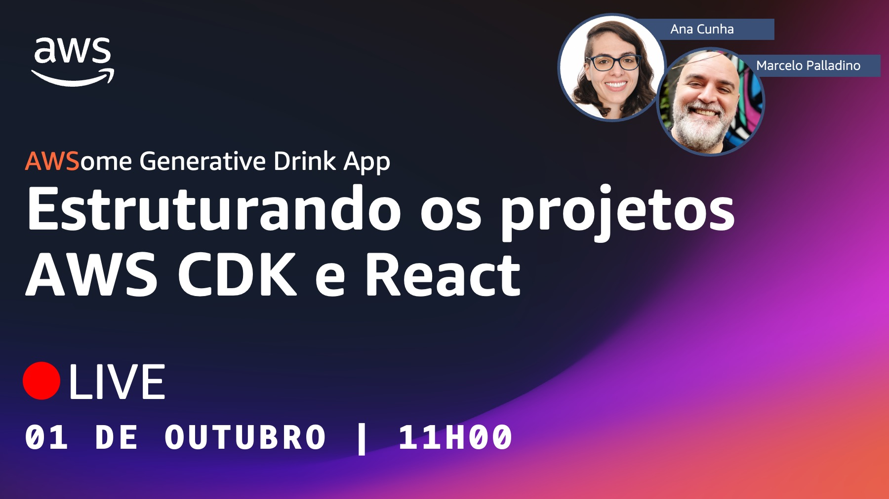

# Episódio 04, Temporada 02 - [NA PRÁTICA - Parte 4] Estruturando os projetos AWS CDK e React

**[&#x25b6; Assista agora no Youtube!](https://bit.ly/cdbe-s02e04)**

Nesta temporada nós vamos construir uma aplicação Serverless completa com IA generativa DO ZERO! 

Neste episódio, vamos utilizar o Amazon Q Developer para nos ajudar a criar as estruturas iniciais dos projetos backend e frontend.  

Esta é a temporada perfeita para você que está começando com desenvolvimento de software na AWS e se interessa em IA generativa.

Bóra Buildar!

## O que mencionamos durante o episódio

[Log de decisões de projeto](../../decision%20log/s02/README.md)

## Onde aprender mais

- [AWSome Generative Drink App (Github)](https://bit.ly/awsome-generative-drink-app)
- [AWSome Generative Drink App (Quadro branco)](https://bit.ly/cdbe-s02-wb)