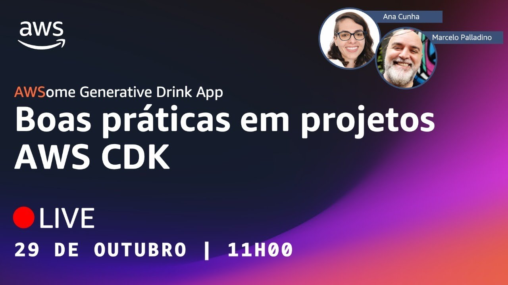

# Episódio 05, Temporada 02 - [NA PRÁTICA - Parte 5] Boas práticas em projetos AWS CDK

**[&#x25b6; Assista agora no Youtube!](https://bit.ly/cdbe-s02e05)**

Bem-vindo(a) a mais um episódio da segunda temporada do AWS Cloud Drops Builders Edition!

Nós estamos construindo uma aplicação Serverless com IA generativa DO ZERO! 

Neste episódio, vamos utilizar o Amazon Q Developer para nos ajudar a ajustar o projeto AWS CDK construído no episódio anterior e ainda compartilhar mais algumas boas práticas contidas em nosso log de decisões de projeto. Infraestrutura como código, AWS CDK, Python, Serverless e mais neste episódio. 

Bóra Buildar!

## O que mencionamos durante o episódio

[Log de decisões de projeto](../../decision%20log/s02/README.md)

## Onde aprender mais

- [AWSome Generative Drink App (Github)](https://bit.ly/awsome-generative-drink-app)
- [AWSome Generative Drink App (Quadro branco)](https://bit.ly/cdbe-s02-wb)