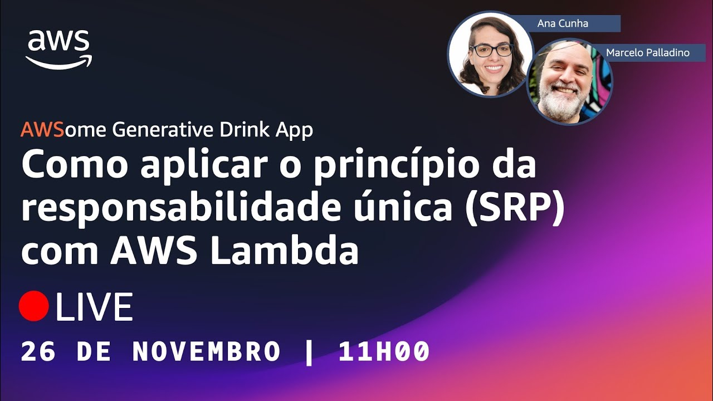

# Episódio 07, Temporada 02 - [NA PRÁTICA - Parte 7] Como aplicar o princípio da responsabilidade única (SRP) com AWS Lambda

**[&#x25b6; Assista agora no Youtube!](https://bit.ly/cdbe-s02e07)**

Bem-vindo(a) a mais um episódio da segunda temporada do AWS Cloud Drops Builders Edition. Nesta temporada estamos construindo uma aplicação Serverless completa com IA generativa DO ZERO. 

Neste episódio, vamos explorar a aplicação do Princípio da Responsabilidade Única (SRP) no contexto do AWS Lambda e refatorar o código que escrevemos até aqui. 

Este episódio é ideal para pessoas interessadas em melhorar a estrutura e manutenibilidade de suas funções Lambda.

Bóra Buildar!

## O que mencionamos durante o episódio

- [Log de decisões de projeto](../../decision%20log/s02/README.md)

## Onde aprender mais

- [AWSome Generative Drink App (Github)](https://bit.ly/awsome-generative-drink-app)
- [AWSome Generative Drink App (Quadro branco)](https://bit.ly/cdbe-s02-wb)