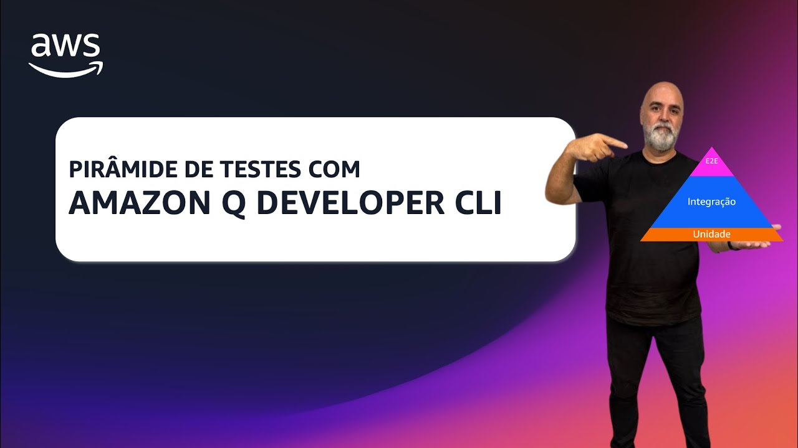

# Episódio 09, Temporada 02 - PIRÂMIDE DE TESTES COM AMAZON Q DEVELOPER CLI

**[&#x25b6; Assista agora no Youtube!](https://bit.ly/cdbe-s02e09)**

Bem-vindo(a) a mais um episódio da segunda temporada do AWS Cloud Drops Builders Edition. Nesta temporada estamos construindo uma aplicação Serverless completa com IA generativa DO ZERO.

Neste episódio, continuamos a construção da aplicação com Amazon Q Developer CLI, explorando a FAMOSA pirâmide de testes.

Focamos no pilar de testes, discutindo a pirâmide de testes clássica, abrangendo testes de unidade, integração e end-to-end na AWS. Implementamos um modelo (schema) de requisição de bebidas usando Amazon Q Developer CLI e validamos a estrutura com testes automatizados.

Bóra Buildar!

## O que mencionamos durante o episódio

- [00:00](https://www.youtube.com/watch?v=OANKFCQ68Lo&t=0s) - Introdução e Contexto da Série
- [00:17](https://www.youtube.com/watch?v=OANKFCQ68Lo&t=17s) - Recapitulando Episódios Anteriores
- [02:18](https://www.youtube.com/watch?v=OANKFCQ68Lo&t=138s) - Explorando o CloudFormation
- [05:18](https://www.youtube.com/watch?v=OANKFCQ68Lo&t=318s) - Introdução ao Pilar de Testes
- [08:12](https://www.youtube.com/watch?v=OANKFCQ68Lo&t=492s) - Testes de Unidade e Integração
- [20:02](https://www.youtube.com/watch?v=OANKFCQ68Lo&t=1202s) - Implementação e Refatoração de Código
- [32:25](https://www.youtube.com/watch?v=OANKFCQ68Lo&t=1945s) - Definindo Campos Obrigatórios e Opcionais
- [34:37](https://www.youtube.com/watch?v=OANKFCQ68Lo&t=2077s) - Requisitos Adicionais e Boas Práticas
- [35:49](https://www.youtube.com/watch?v=OANKFCQ68Lo&t=2149s) - Implementação e Testes de Unidade
- [41:22](https://www.youtube.com/watch?v=OANKFCQ68Lo&t=2482s) - Gerenciamento de Prompts e Ferramentas
- [44:57](https://www.youtube.com/watch?v=OANKFCQ68Lo&t=2697s) - Execução e Revisão de Testes
- [58:55](https://www.youtube.com/watch?v=OANKFCQ68Lo&t=3535s) - Conclusão e Próximos Passos

## Onde aprender mais

- [AWSome Generative Drink App (Github)](https://bit.ly/awsome-generative-drink-app)
- [AWSome Generative Drink App (Quadro branco)](https://bit.ly/cdbe-s02-wb)
- 💻 [Siga a Ana](https://www.linkedin.com/in/analuizacunha/)
- 💻 [Siga o Palla](https://www.linkedin.com/in/mfpalladino/)