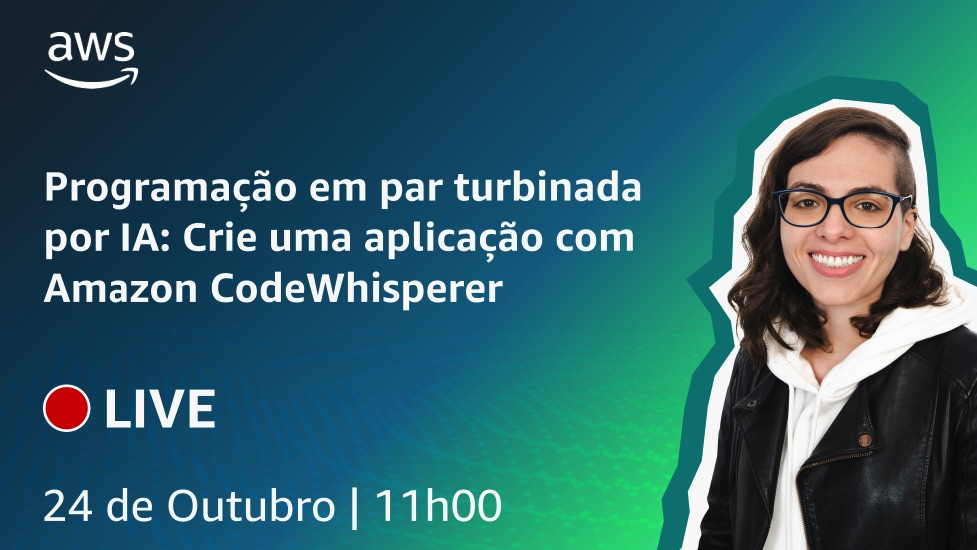

# Episódio 3 - Programação em par turbinada por IA: Crie uma aplicação com Amazon CodeWhisperer

**[&#x25b6; Assista agora no Youtube!](https://www.youtube.com/watch?v=nMNPN0q8Sfo)**

Neste episódio você vai descobrir o [Amazon CodeWhisperer](https://aws.amazon.com/codewhisperer/?trk=f6a5abea-70e5-45dc-9cf2-5c73627a52bc), seu parceiro de código turbinado por IA, enquanto é guiado pelo processo de criação de uma aplicação de galeria de imagens usando React e AWS Amplify. Junte-se a nós e venha aprender sobre o desenvolvimento de aplicações com assistência de IA. 

Neste episódio você verá como um prompt é processado e também como é a experiência no [Amazon Bedrock](https://aws.amazon.com/bedrock/), tanto no console da AWS, quanto para realizar chamadas ao serviço utilizando [boto3](https://boto3.amazonaws.com/v1/documentation/api/latest/index.html).   

Se você gostou do conteúdo e que ser notificado sobre próximos episódios, [por favor, assine o canal](https://www.youtube.com/@AmazonWebServicesLatinAmerica).

Palavras-chave: Geração de código por IA 

## O que mencionamos durante o episódio

## 🐛 Bugs em produção

## 🫰 Dívida técnica

Nenhuma dívida técnica foi adquirida neste episódio.

## Onde aprender mais

* [Página do serviço](https://bit.ly/amazon-code-whisperer)
* [Repositório no Github com a aplicação de exemplo](https://bit.ly/cdbe-s01e03-code)

**[DeepLearning.AI](https://www.deeplearning.ai/courses/generative-ai-with-llms/)**
