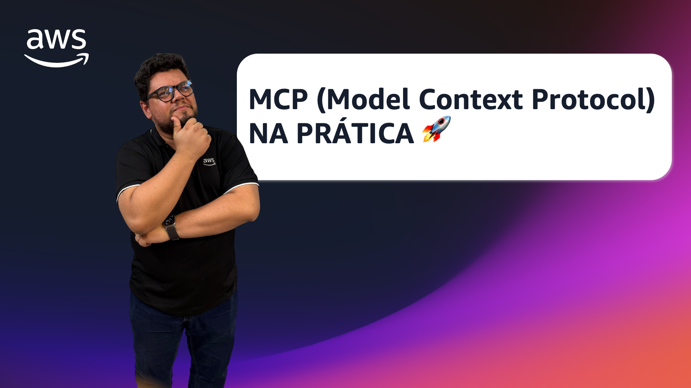

# Episódio 10, Temporada 02 - MCP (Model Context Protocol) NA PRÁTICA 🚀

**[&#x25b6; Assista agora no Youtube!](https://bit.ly/cdbe-s02e10)**

Neste episódio, recebemos Neylson Crepalde para discutir o Model Context Protocol (MCP) e suas aplicações práticas. Exploramos como o MCP simplifica a integração de modelos de IA generativa com dados externos e ferramentas, substituindo métodos complexos por soluções mais eficientes e escaláveis.

Bóra buildar!

## O que mencionamos durante o episódio

- [Introdução](https://www.youtube.com/watch?v=Y8AdqiR5pEQ&t=0s)
- [O Trabalho do Ney na AWS](https://www.youtube.com/watch?v=Y8AdqiR5pEQ&t=63s)
- [Introdução ao Model Context Protocol (MCP)](https://www.youtube.com/watch?v=Y8AdqiR5pEQ&t=135s)
- [Desafios e Soluções com MCP](https://www.youtube.com/watch?v=Y8AdqiR5pEQ&t=284s)
- [Demonstração Prática do MCP](https://www.youtube.com/watch?v=Y8AdqiR5pEQ&t=844s)
- [Considerações Finais e Lançamentos Recentes do Amazon Q Developer CLI](https://www.youtube.com/watch?v=Y8AdqiR5pEQ&t=1955s)

## Onde aprender mais

- [Introdução ao MCP](https://www.anthropic.com/news/model-context-protocol)
- [Exemplos com InlineAgent](https://github.com/awslabs/amazon-bedrock-agent-samples/tree/main/src/InlineAgent/examples/mcp)
- [Apresentando Servidores AWS MCP para assistentes de código](https://aws.amazon.com/pt/blogs/machine-learning/introducing-aws-mcp-servers-for-code-assistants-part-1/)
- [AWS MCP Servers](https://github.com/awslabs/mcp/)
- [Post de lançamento do suporte oficial de MCP no Amazon Q Developer CLI](https://aws.amazon.com/pt/blogs/devops/extend-the-amazon-q-developer-cli-with-mcp/)
- [Amazon Q Developer na linha de comando](https://bit.ly/amazon-q-dev-brasil)
- [Siga o Ney](https://www.linkedin.com/in/neylsoncrepalde/)
- [Siga o Palla](https://www.linkedin.com/in/mfpalladino/)