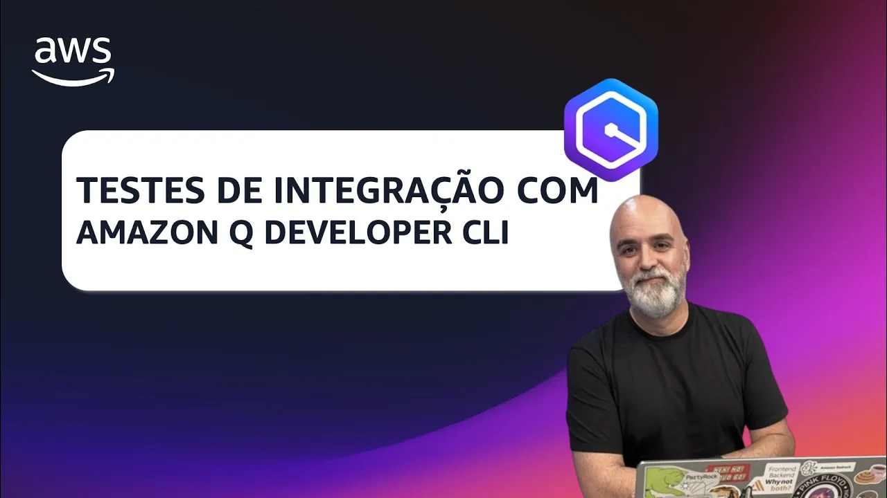

# Episódio 12, Temporada 02 - TESTES DE INTEGRAÇÃO COM AMAZON Q DEVELOPER CLI

**[&#x25b6; Assista agora no Youtube!](https://bit.ly/cdbe-s02e12)**

Neste episódio do Cloud Drops Builders Edition vamos continuar a criação de uma aplicação desde o zero usando inteligência artificial (IA) tanto para a própria aplicação quanto para sua construção, com Amazon Q Developer CLI. 

Vamos nos concentrar na implementação e refinamento de testes de integração da função que persiste requisições iniciais de drinks em uma tabela DynamoDB, lidando com desafios como a recuperação de nomes de tabelas a partir da stack do CloudFormation e a injeção de variáveis de ambiente para que o teste funcione. Também vamos abordar a refatoração de código para melhorar a robustez e a manutenção do que fizemos até aqui.

Bóra Buildar!

## O que mencionamos durante o episódio

* [00:00](https://youtu.be/nYSe6dAIEwM?t=0) Introdução e Boas-vindas
* [01:27](https://youtu.be/nYSe6dAIEwM?t=87) Recapitulando o Episódio Anterior
* [02:04](https://youtu.be/nYSe6dAIEwM?t=124) Testes de Integração com PyTest
* [04:38](https://youtu.be/nYSe6dAIEwM?t=278) Acessando o Amazon QCLI
* [05:25](https://youtu.be/nYSe6dAIEwM?t=325) Ajustando o Modelo DrinkRequest
* [10:39](https://youtu.be/nYSe6dAIEwM?t=639) Melhorando a Verificação de Erros
* [15:40](https://youtu.be/nYSe6dAIEwM?t=940) Escrevendo Testes de Integração
* [27:27](https://youtu.be/nYSe6dAIEwM?t=1647) Modificando a stack CDK
* [28:25](https://youtu.be/nYSe6dAIEwM?t=1705) Configurando o teste de integração
* [28:57](https://youtu.be/nYSe6dAIEwM?t=1737) Refinando as Fixtures
* [32:11](https://youtu.be/nYSe6dAIEwM?t=1931) Rodando os testes de integração
* [39:00](https://youtu.be/nYSe6dAIEwM?t=2340) Fazendo o deploy do backend
* [44:11](https://youtu.be/nYSe6dAIEwM?t=2651) Lidando com os erros do teste de integração
* [47:32](https://youtu.be/nYSe6dAIEwM?t=2852) Mais refatoração
* [53:09](https://youtu.be/nYSe6dAIEwM?t=3189) Encerramento e próximos passos

## Onde aprender mais

- [Amazon Q Developer na linha de comando](https://bit.ly/amazon-q-dev-brasil)
- 💻 [Siga a Ana](https://www.linkedin.com/in/analuizacunha/)
- 💻 [Siga o Palla](https://www.linkedin.com/in/mfpalladino/)