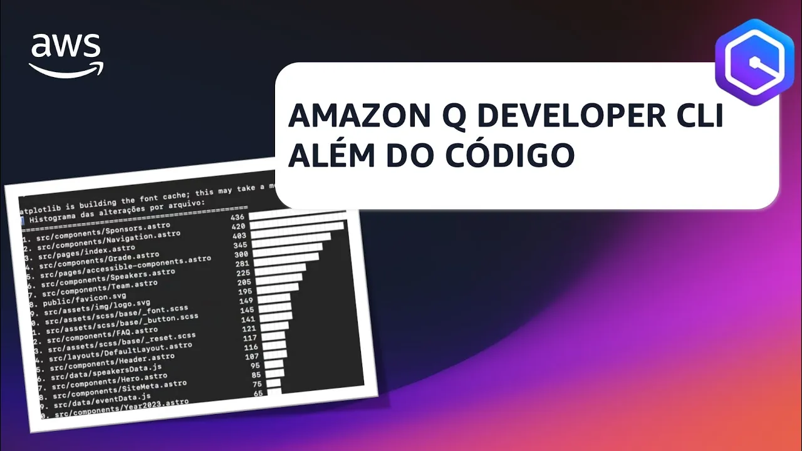

# Episódio 13, Temporada 02 - AMAZON Q DEVELOPER CLI ALÉM DO CÓDIGO COM O AWS SERVERLESS HERO EVANDRO PIRES

**[&#x25b6; Assista agora no Youtube!](https://bit.ly/cdbe-s02e13)**

Neste episódio vamos receber o AWS Serverless Hero Evandro Pires para compartilhar como ele tem usado o Amazon Q Developer CLI para ganhar produtividade além da tarefa de escrever códigos. 

Vem, que ele inclusive vai nos mostrar como instalar o Amazon Q Developer CLI DO ZERO! 

Bóra Buildar além do código!

## O que mencionamos durante o episódio

* [00:46](https://youtu.be/e2oGYRiADWY?t=46) Apresentação do Evandro Pires, AWS Hero e Serverless Hero 
* [02:39](https://youtu.be/e2oGYRiADWY?t=159) Motivação para usar o AWS CLI 
* [04:51](https://youtu.be/e2oGYRiADWY?t=291) Instalação e configuração do AWS CLI 
* [07:34](https://youtu.be/e2oGYRiADWY?t=454) Usando o AWS CLI para executar comandos e resolver problemas 
* [14:31](https://youtu.be/e2oGYRiADWY?t=871) Gerando um histograma de alterações em um projeto Git usando o AWS CLI 
* [27:47](https://youtu.be/e2oGYRiADWY?t=1667) Importância de usar o AWS CLI como ferramenta principal, além do código 
* [32:05](https://youtu.be/e2oGYRiADWY?t=1925) Informações sobre eventos e contatos do Evandro Pires

## Onde aprender mais

- [Amazon Q Developer na linha de comando](https://bit.ly/amazon-q-dev-brasil)
- [Iniciativas do Evandro](https://linktr.ee/epiresdasilva)
- 💻 [Siga a Evandro](https://www.linkedin.com/in/epiresdasilva/)
- 💻 [Siga o Palla](https://www.linkedin.com/in/mfpalladino/)