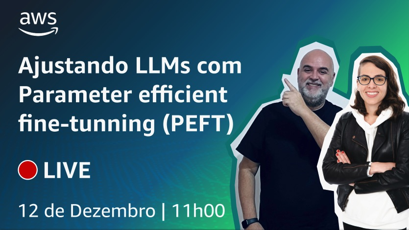

# Episódio 6 - Ajustando LLMs com Parameter efficient fine-tunning (PEFT)

**[&#x25b6; Assista agora no Youtube!](https://www.youtube.com/watch?v=18eWp6ceP4k)**

Como vimos no último episódio, o ajuste de LLMs é computacionalmente intensivo. O ajuste fino completo requer memória não apenas para armazenar o modelo, mas vários outros parâmetros que são necessários durante o processo de treinamento. Mesmo que o seu computador possa suportar o tamanho do modelo, que agora é da ordem de centenas de gigabytes para os modelos maiores, você também deve ser capaz de alocar memória para vários componentes adjacentes e memória temporária durante todo o processo de treinamento. Esses componentes adicionais podem ser muitas vezes maiores que o modelo e podem rapidamente se tornar grandes demais para serem manuseados em hardware de uso geral. 

Neste episódio, veremos alternativas ao ajuste fino completo, utilizando o Parameter efficient fine-tuning (PEFT), para utilizar técnicas que atualizam apenas um pequeno subconjunto de parâmetros. 

## O que mencionamos durante o episódio

* 00:00:00 Introdução
* 00:01:20 Amazon SageMaker Studio Lab
* 00:04:56 PartyRocket, um aplicativo feito com IA generativa no PartyRock
* 00:11:31 Recapitulando o final do episódio 5
* 00:13:45 O ciclo de vida de um projeto com IA generativa
* 00:14:21 Os desafios para avaliar LLMs
* 00:19:00 Métricas: ROUGE e BLEU
* 00:20:51 Métricas: Terminologia
* 00:21:51 Métricas: ROUGE-1
* 00:24:48 Métricas: ROUGE-2
* 00:26:24 Métricas: ROUGE-L
* 00:29:50 Os desafios do full fine-tuning
* 00:31:21 Parameter Efficient Fine-Tuning (PEFT)
* 00:36:49 Comparando as abordagens de fine-tuning
* 00:38:43 PEFT trade-offs
* 00:39:48 Métodos PEFT
* 00:45:25 Juntando tudo no código
* 01:06:09 Finalização

## 🐛 Bugs em produção

## 🫰 Dívida técnica

## Onde aprender mais

* [Código utilizado neste episódio (guithub)](https://github.com/AWS-Cloud-Drops-Builders-Edition/s01e06)
* [PartyRocket - build web apps with gen AI](https://partyrock.aws/u/mza/pDK3iF1kb/PartyRocket-build-web-apps-with-gen-AI/snapshot/xKLiQfwHd)
* [AWS re:Invent 2023 - Keynote with Dr. Werner Vogels](https://www.youtube.com/watch?v=UTRBVPvzt9w)
* [HELM is a living benchmark to evaluate Language Models more transparently](https://crfm.stanford.edu/helm/latest/)
* [Este artigo apresenta o GLUE, uma referência para avaliar modelos em diversas tarefas de compreensão de linguagem natural (NLU) e enfatiza a importância de sistemas NLU gerais aprimorados](https://openreview.net/pdf?id=rJ4km2R5t7)
* [Este artigo apresenta o SuperGLUE, um benchmark projetado para avaliar o desempenho de vários modelos de PNL em uma série de tarefas desafiadoras de compreensão de linguagem](https://super.gluebenchmark.com/)
* [Este artigo apresenta e avalia quatro medidas diferentes (ROUGE-N, ROUGE-L, ROUGE-W e ROUGE-S) no pacote de avaliação de resumo ROUGE, que avalia a qualidade dos resumos comparando-os com resumos ideais gerados por humanos](https://aclanthology.org/W04-1013.pdf)
* [Este artigo apresenta um novo teste para medir a precisão multitarefa em modelos de texto, destacando a necessidade de melhorias substanciais para alcançar a precisão de nível especializado e abordar o desempenho desequilibrado e a baixa precisão em assuntos socialmente importantes](https://arxiv.org/pdf/2009.03300.pdf)
* [O artigo apresenta o BIG-bench, um benchmark para avaliar modelos de linguagem em tarefas desafiadoras, fornecendo insights sobre escala, calibração e preconceito social](https://arxiv.org/pdf/2206.04615.pdf)

**[Bóra construir uma aplicação baseada em IA](https://partyrock.aws/)**

**[DeepLearning.AI](https://www.deeplearning.ai/courses/generative-ai-with-llms/)**
