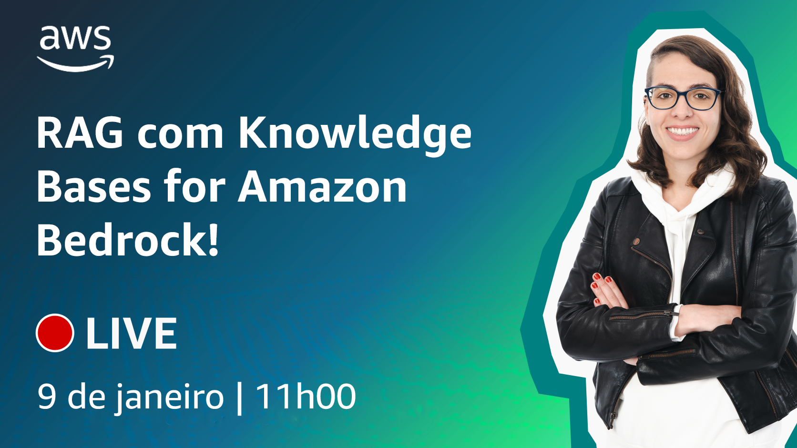

# Episódio 7 - Usando RAG para melhorar respostas utilizando Knowledge Bases for Amazon Bedrock

**[&#x25b6; Assista agora no Youtube!](https://www.youtube.com/watch?v=7lF8_9bG15Q)**

Nos últimos dois episódios falamos de fine-tuning, como forma de fazer suas aplicações de IA generativa podem fornecer melhores respostas incorporando dados específicos da organização. Neste episódio, vamos abordar uma técnica conhecida como Retrieval Augmented Generation (RAG). No entanto, a implementação do RAG requer tempo para configurar conexões com fontes de dados, gerenciar fluxos de trabalho de ingestão de dados e escrever código personalizado para gerenciar as interações entre o modelo fundacional (FM) e as fontes de dados. Nós receberemos o [Allex Lima](https://www.linkedin.com/in/allexlimas/), que irá nos mostrar como tornar o processo muito mais fácil, utilizando o Amazon Bedrock. 

## O que mencionamos durante o episódio

## 🐛 Bugs em produção

## 🫰 Dívida técnica

Graças ao Palla, que esqueceu o copo em seu armário no escritório 😂, não conseguimos trazer o copo do Hamilton, conforme divulgado antes do episódio. 

## Onde aprender mais

* [RAG para tarefas de PNL com uso intensivo de bases de conhecimento (Paper)](https://arxiv.org/abs/2005.11401v4)
* [Exemplo de como construir um chatbot multi-tenant com RAG utilizando Amazon Bedrock](https://aws.amazon.com/pt/blogs/containers/build-a-multi-tenant-chatbot-with-rag-using-amazon-bedrock-and-amazon-eks/)
* [Exemplos de código com Amazon Bedrock (GitHub)](https://github.com/aws-samples/amazon-bedrock-samples)

**[Bóra construir uma aplicação baseada em IA](https://partyrock.aws/)**

**[DeepLearning.AI](https://www.deeplearning.ai/courses/generative-ai-with-llms/)**
