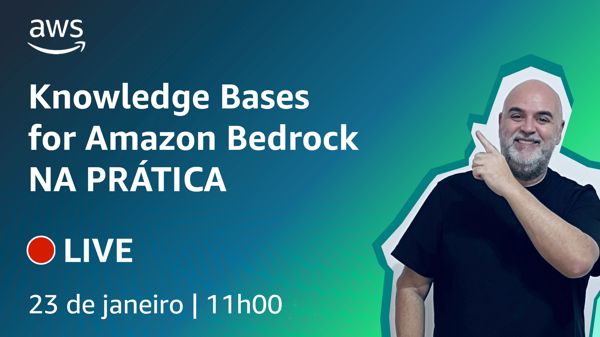

# Episódio 8 - Knowledge Bases for Amazon Bedrock NA PRÁTICA

**[&#x25b6; Assista agora no Youtube!](https://www.youtube.com/watch?v=tS8GfsnMSbI)**

No [último episódio](https://www.youtube.com/watch?v=7lF8_9bG15Q) recebemos o [Allex Lima](https://www.linkedin.com/in/allexlimas/) e vimos muitos conceitos sobre Retrieval Augmented Generation (RAG) e Knowledge Bases for Amazon Bedrock. Este é um episódio 100% de mão na massa, que assume que você assistiu o último. Então vem com a gente nessa e vamos aplicar os conceitos na PRÁTICA!

Bóra buildar!

## O que mencionamos durante o episódio

## 🐛 Bugs em produção

## 🫰 Dívida técnica

## Onde aprender mais

* [Usando RAG para melhorar respostas utilizando Knowledge Bases for Amazon Bedrock (episódio 7)](https://www.youtube.com/watch?v=7lF8_9bG15Q)
* [Exemplos de código com Amazon Bedrock (GitHub)](https://github.com/aws-samples/amazon-bedrock-samples)

**[Bóra construir uma aplicação baseada em IA](https://partyrock.aws/)**

**[DeepLearning.AI](https://www.deeplearning.ai/courses/generative-ai-with-llms/)**
