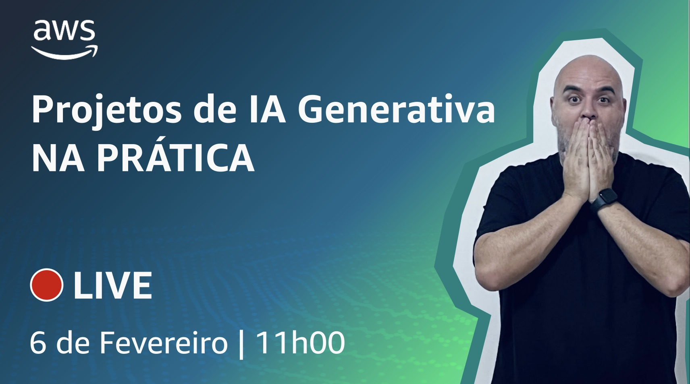

# Episódio 9 - Projetos de IA Generativa NA PRÁTICA

**[&#x25b6; Assista agora no Youtube!](https://www.youtube.com/watch?v=6FC9iFdLoZQ)**

Durante os últims episódios, temos reforçado a importância da tangibilização da tecnologia para os aspectos do negócio, quando falamos de IA Generativa. Neste episódio, convidamos a [Leticia Dornelas](https://www.linkedin.com/in/leticiadornelas/), Solutions Architect da AWS, para uma sessão de quadro branco, na qual vamos bater um papo e ela vai compartilhar casos de uso e soluções que estão utilizando IA Generativa na vida real. 

Bóra desenhar, para depois Buildar!

## O que mencionamos durante o episódio

- 00:00:00 Introdução e apresentações
- 00:02:58 O (famoso) Ciclo de vida de um projeto com IA Generativa
- 00:05:18 Desenho de uma solução para corrigir redações do ENEM
- 00:20:39 Uma solução Serverless
- 00:28:18 Agradecendo o Diego, fundador do AWS User Group Blumenau, pela incrível garrafa usada no episódio 
- 00:28:55 Juntando tudo na demonstração
- 00:35:56 Juntando tudo no código
- 00:41:08 Evoluindo a solução
- 00:46:26 Demo: Usando as questões do ENEM como base para RAG (Retrieval-augmented generation)
- 00:57:41 Finalização

## 🐛 Bugs em produção

## 🫰 Dívida técnica

## Onde aprender mais

* [Avaliando LLMs](https://aws.amazon.com/pt/blogs/machine-learning/evaluate-large-language-models-for-quality-and-responsibility/)
* [Avaliação de modelos (em preview)](https://docs.aws.amazon.com/bedrock/latest/userguide/model-evaluation.html)
* [Monitorando aplicativos de IA generativa usando a integração do Amazon Bedrock e do Amazon CloudWatch](https://aws.amazon.com/pt/blogs/mt/monitoring-generative-ai-applications-using-amazon-bedrock-and-amazon-cloudwatch-integration/)
* [Construindo um chat de documentos serverless com AWS Lambda e Amazon Bedrock](https://aws.amazon.com/pt/blogs/compute/building-a-serverless-document-chat-with-aws-lambda-and-amazon-bedrock/?ref=serverlessland)
* [Lex + Kendra + Bedrock](https://aws.amazon.com/pt/blogs/machine-learning/deploy-generative-ai-self-service-question-answering-using-the-qnabot-on-aws-solution-powered-by-amazon-lex-with-amazon-kendra-and-amazon-bedrock/)
* [Converta documentos e media utilizando Inteligencia Artificial](https://aws.amazon.com/pt/blogs/aws-brasil/converta-documentos-e-media-utilizando-inteligencia-artificial/)

**[Bóra construir uma aplicação baseada em IA](https://partyrock.aws/)**

**[DeepLearning.AI](https://www.deeplearning.ai/courses/generative-ai-with-llms/)**
