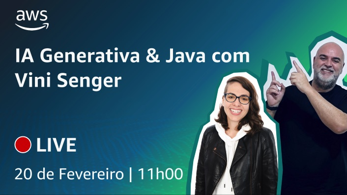
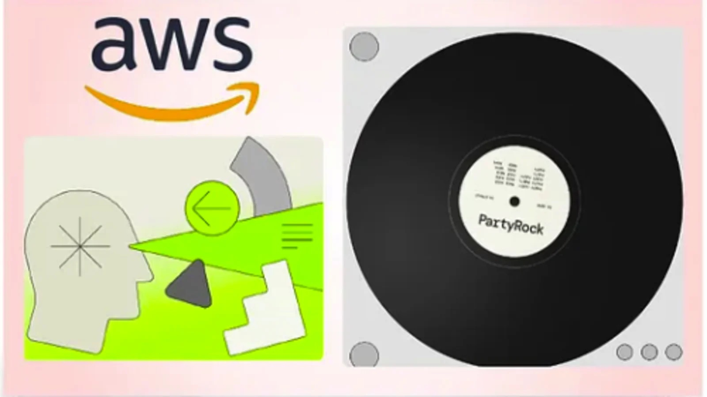

# Episódio 10 - IA Generativa & Java com Vini Senger

**[&#x25b6; Assista agora no Youtube!](https://www.youtube.com/watch?v=zkhMc-nzm-k)**

Neste episódio, convidamos o [Vinicius Senger](https://www.linkedin.com/in/viniciussenger/), Senior Developer Advocate, Specialist Team na AWS, para uma conversa sobre como a IA Generativa está afetando o mundo Java e seus Builders. 

Bóra Buildar!

## O que mencionamos durante o episódio

00:00:00 Introdução
00:01:27 O museu da história da tecnologia grega e um robô mecânico para servir vinho 250 AC
00:07:02 O estado do Java na AWS
00:15:41 A forma como aprendemos está mudando 
00:24:21 Amazon Q na IDE
00:31:08 Amazon CodeWhisperer no terminal
00:33:27 Exemplos de utilização do Amazon Q
00:33:35 Amazon Q Code Transformation
00:42:22 Java Foundation Model (FM) Playground 
00:46:00 Quarkus Roblox Workshop
00:54:07 Finalização

## 🐛 Bugs em produção

## 🫰 Dívida técnica

## Onde aprender mais

* [AWS Java Academy](https://catalog.workshops.aws/java-academy/en-US)
* [Java Foundations Model Playground (Github)](https://github.com/build-on-aws/java-fm-playground)
* [Lessons Learned from Upgrading and Modernizing a Massive JVM Codebase at AWS by Volker Simonis](https://www.youtube.com/watch?v=7DKQ8OdGfmk)
* [AWS Java Links](https://www.linkedin.com/posts/viniciussenger_activity-7128135806795333632-KGY_/?utm_source=share)

**[Bóra construir uma aplicação baseada em IA](https://partyrock.aws/)**

**[DeepLearning.AI](https://www.deeplearning.ai/courses/generative-ai-with-llms/)**
